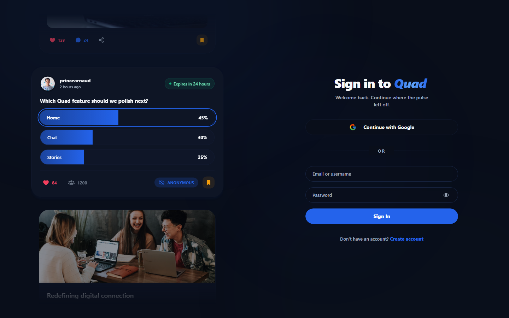
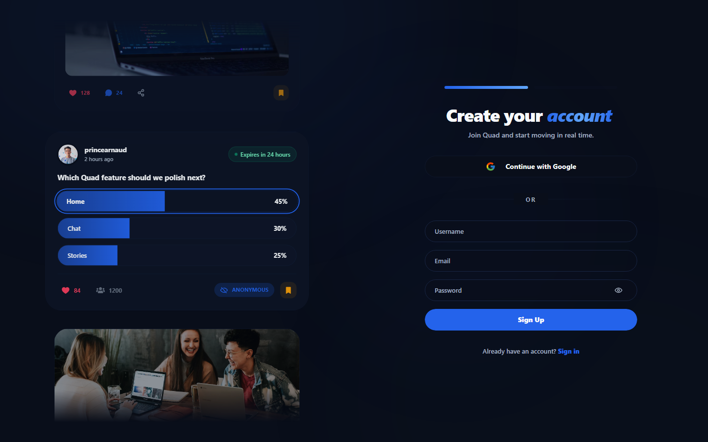

# Quad

Quad is a full-stack student social platform for campus conversation and entertainment. It combines posts, stories, polls, profiles, social relationships, global chat, and notifications in a responsive web app.

**Live demo:** [joinquad.vercel.app](https://joinquad.vercel.app)

## What it does

- Publish posts with images or video; comment, react, and bookmark.
- Create stories and polls; follow people and view profiles.
- Chat in real time and receive real-time notifications.
- Switch between light, dark, and system themes; install the web app where supported.

## Public preview

The public auth experience is available without exposing private feeds or bypassing Clerk. Screenshots were captured from the production build during the release-candidate audit.

| Sign in | Create account |
| --- | --- |
|  |  |

## Architecture

| Directory | Purpose |
| --- | --- |
| `frontend/` | React 19, TypeScript, Vite, React Router, Tailwind CSS, Clerk, Zustand, Axios, Socket.IO client, TipTap, Radix primitives, Framer Motion |
| `backend/` | Node.js, Express 5, TypeScript, MongoDB/Mongoose, Clerk, Socket.IO, Cloudinary, Zod |
| `docs/` | Setup, deployment, architecture, and current quality status |

The frontend uses Clerk for sign-in and sends a session token to the API and Socket.IO server. The backend validates requests, stores social data in MongoDB, and sends chat and notification events through Socket.IO. Cloudinary stores uploaded media.

## Security and reliability

The API uses Clerk authentication, request validation, rate limits, security headers, origin checks, and upload type and size validation. Destructive media actions verify ownership. API errors avoid exposing internal details in production. See the [current quality status](docs/QUALITY_STATUS.md) for verified checks and remaining limitations.

## Run locally

Use Node.js **24.19.0** (see `.nvmrc`), npm, and a local or hosted MongoDB instance. Clerk and Cloudinary credentials are required for the full app.

1. Copy `backend/.env.example` to `backend/.env` and `frontend/.env.example` to `frontend/.env`, then fill in your credentials. Keep `.env` files private.
2. From the repository root, run `npm run setup` to install both packages from their lockfiles.
3. In separate terminals, run `npm --prefix backend run dev` and `npm --prefix frontend run dev`.
4. Open the Vite URL (normally `http://localhost:5173`). The API defaults to `http://localhost:4000`.

The backend examples describe the required variables. [Getting started](docs/GETTING_STARTED.md) has additional setup detail.

## Verify

From the repository root:

| Command | Action |
| --- | --- |
| `npm run setup` | Clean install both packages |
| `npm run lint` | Lint frontend and backend |
| `npm run typecheck` | Typecheck frontend and backend |
| `npm test` | Run both test suites |
| `npm run build` | Build backend and frontend |
| `npm run check` | Run lint, typecheck, tests, and builds |

Backend integration tests use `mongodb-memory-server` and need permission to bind to localhost. See [testing](docs/TESTING.md) and [quality status](docs/QUALITY_STATUS.md) for the latest measured result.

## Deployment and docs

The live frontend is hosted at the URL above. For a separate deployment, configure the backend, MongoDB, Clerk, Cloudinary, allowed frontend origin, and matching frontend API and Socket.IO URLs. See the [deployment guide](docs/DEPLOYMENT.md) and [documentation hub](docs/README.md). A live demo does not imply a published backend hosting contract or measured production scale.

Quad is a portfolio product project built to demonstrate full-stack design and engineering. It has no claimed user or traffic metrics.
